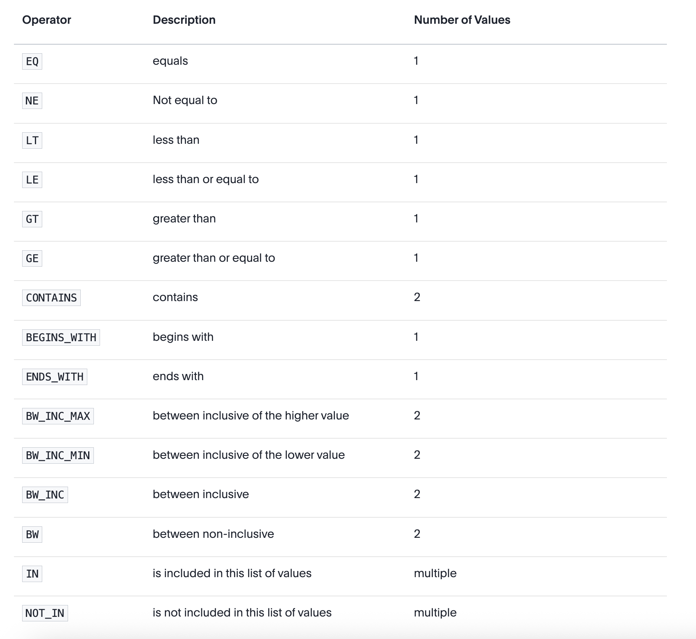

This helps to set the runtimefilters for the data and scope them.

Example:
```
    runtimeFilters: [
        {
            columnName: "Area Market",
            operator: RuntimeFilterOp.EQ,
            values: ["ATL"]               
        }
    ]
```

Supported Operations:


Note: Everything should be placed in square brackets.